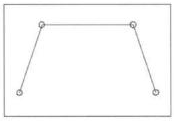

### Control Points: The Start of CAGD



Take four points in a plane and connect them to form a polygon.  The four points may be called *control points*, in that they *are points in two or more dimensions that define the behavior of the resulting curve*.  The polygon formed by connecting the control points in the "correct" order are called the *control polygon*.  The control polygon provides a crude analogy of the refined curve.  Note that the control polygon is typically open (the ends are not coincident), and it may self-intersect.  The control points and the control polygon determine the approximate shape of the curve to be formed.


#### Exercise 1.5.1

In this exercise, you'll create an application  in threejs using `template/` as a starting point.

1. Follow the detailed instructions in `template/README.md` describing how to create a new application using `template/` as a starting point.
2. Make sure to read the code.  You'll want to keep the threejs documentation for r124 handy.  Look up the classes and methods as you read.  There's no faster way to learn threejs.
3. After completing the instructions you should see a black screen with a sort of rotating cube that looks like this:

</img>

4. Now turn off the animation.
5. Show the result to your tutor.


<br>
<br>

#### Exercise 1.5.2

1. Create a new project from `template/`, and use this code to render a starscape.

1. Here is some sample code which you can use to create a kind of starscape.
```javascript
const vertices = [];

for ( let i = 0; i < 10000; i ++ ) {

const x = THREE.MathUtils.randFloatSpread( 2000 );
const y = THREE.MathUtils.randFloatSpread( 2000 );
const z = THREE.MathUtils.randFloatSpread( 2000 );

vertices.push( x, y, z );

}

const geometry = new THREE.BufferGeometry();
geometry.setAttribute( 'position', new THREE.Float32BufferAttribute( vertices, 3 ) );

const material = new THREE.PointsMaterial( { color: 0x888888 } );

const points = new THREE.Points( geometry, material );

scene.add( points );
```

2. You should see something like this when you're done:

   </img>

7. Show your tutor.

<br>
<br>

#### Exercise 1.5.3

In this exercise, you're going to draw the little four-control-point image at the top of this page.

1. Create a new project from `template/`.
2. Draw a single black line on a white background. Here's some code to get you started:
```javascript
// Notice the change in camera position here.
// Without this, you won't be able to see much (or any) of the line segment.
camera.position.z = 15;

const material = new THREE.LineBasicMaterial({color: 0x0000ff});

const points = [];
points.push( new THREE.Vector3( -10, 0, 0 ) );
points.push( new THREE.Vector3( 0, 10, 0 ) );

const geometry = new THREE.BufferGeometry().setFromPoints( points );

const line = new THREE.Line( geometry, material );
scene.add( line );
```
3. You should now see something like this
</img>
4. This is a start, but doesn't look much like the image at the top of this page.  For one thing it's a blue line on a black background, and what we need is a black line on a white background.
4. Let's start by changing the background to white.  Here's a snippet.
```javascript
    scene.background = new THREE.Color(0xFFFFFF)
```
4. Can you guess how to change the line color to black?
5. Up to now, we've been using a PerspectiveCamera, but for most of our examples, we'll be working in 2D, so let's replace our PerspectiveCamera with an Orthographic Camera.
```javascript
   const camera = new THREE.OrthographicCamera( -10, 10, 10, -10, 1, 1000 );
```
6. This will establish an origin in the center of your browser. The x and y scales go from -10 to 10 so the line you drew before will touch the left and top of the screen:
</img>
6. If you've begun to notice that the line is a big jaggy and awfully thin, try not to freak.  We'll get to that.
6. Adjust the position of the end-points of the line to make it take the position approximately like that shown in the image at the top of page.
</img>
8. Can you figure out how to draw the remaining lines?  Don't worry about the little circles yet.
   </img>
9. Did you notice that the lines went from vertex to vertex, and that the order of the vertices matters?
9. Now you might be tempted to surf the three.js documentation, find and use the CircleBufferGeometry class to create a circle and add it to the scene, but this won't be very satisfying, because the CircleBufferGeometry displays a filled circle rather than a line circle. THREE.CircleBufferGeometry should probably be named THREE.DiscBufferGeometry. Sadly, no appropriate CircleBufferGeometry exists, so we'll have to make our own.
9. To create our own CircleBufferGeometry, we can define our own class extending BufferGeometry.  The syntax for javascript classes may be found in the Mozilla Development Network (MDN) site [here](https://developer.mozilla.org/en-US/docs/Web/JavaScript/Reference/Classes).
9. Can you start designing the class definition based on the example of Rectangle from the MDN page? 
10. Here's some code to use to get started:
```javascript
import { BufferGeometry } from 'three';

class CircleBufferGeometry extends BufferGeometry {
    radius = 1;
    x = 0; y = 0;
    segments = 32;
    vertices = [];

    constructor(/* double */ radius, /* double */ x, /* double */ y, /* int */ segments) {
        super();

        if (radius)
            this.radius = radius;

        if (x)
            this.x = x;

        if (y)
            this.y = y;

        if (segments)
            this.segments = segments;

        for (let angle = 0, segment = 0; segment <= this.segments; angle = segment * 2 * Math.PI / this.segments, segment++) {
            this.vertices.push( new THREE.Vector3( this.x + this.radius * Math.cos(angle), this.y + this.radius * Math.sin(angle), 0 ) );
        }
        this.setFromPoints( this.vertices );
    }
}
```
9. Can you figure out how to use this code. 
9. Now position its center so that it looks like this:
9. asdf
9. Now add a second circle like this:
9. asdf
14. And finally draw a rectangle around it all like this:
15. asdf
16. Show your tutor


#### Exercise 1.5.4

In this section you're going to make your drawing object-oriented (if you haven't already).  You should have a class for a Line, a Circle and a Rectangle.  These should not conflict with anything of the same name in three.js

1. Create a Line class
2. Create three instances of the class, one for each of the three lines from 1.5.2
3. Create a Circle class
4. Create two instances of the class, one for each of the circles from 1.5.2
5. Create a Rectangle class
6. Create one instance of the class for the rectangle from 1.5.2
7. Your result should look the same as that of 1.5.2
8. asdf
9. Show your tutor your code and your drawing.