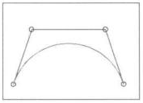

### A CAGD Favorite: The Bézier Curve

A special curve known as the *Bézier Curve* may be generated by the control points.  Notice that while the curve passes through the end-points of the control polygon, it only comes close to the other points.

We will write code for Bézier Curves.  Below you can see what's called a cubic Bézier curve.  A cubic Bézier curve is a cubic polynomial.  In other words it is a polynomial of degree 3.  You  can think of a cubic Bézier being described mathematically thus: $y = ax^3 + bx^2 + cx + d$ . 
<iframe style="margin: 0 20% 0 20%; height: 400px; width: 400px; border: none;" data-trusted="1" src="https://en.js.cx/article/bezier-curve/demo.svg?p=0,0,.2,0.7,0.8,.7,1,0"></iframe>

A cubic Bézier has four control points which are shown here numbered $1$ to $4$ .  Please move these around on the background grid and notice the effect that their position has on the curve.

Are you beginning to see why Bézier curves are used so frequently in CAGD?

#### Exercise 1.6.1

In this exercise, you're going to draw add an arc to your last exercise.

1. Make a copy of your Exercise 1.5.3 and name it Exercise 1.6.1
2. Add a new Line geometry to your diagram.
3. Construct the Line geometry from a set of points based on a quadratic polynomial: $y = ax^2 + bx + c$
4. Attempt to make your rendering look approximately like the image at the start of this page.
5. Make sure that you encapsulate this geometry as its own class.
6. Don't be surprised if this takes quite a while to get looking right. It's tricky.

#### Exercise 1.6.2

1. For extra karma, attempt to produce something that looks like the image above using a cubic polynomial: $y = ax^3 + bx^2 + bx + d$
2. Don't be surprised if this takes a long time to figure out, and feel free to give up for now.
3. The point is that it's freaking hard to make a cubic fit the points nicely by hand.
