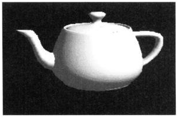

### Three-Dimensional Shaded Object

If the surface produced by the three-dimensional Bézier patches is illuminated and shaded, an object with a realistic appearance results.  The original Utah Teapot, a rendition of which is shown in the image, is actually on display at the Boston Museum of Computer History.  It is a classic in CAGD and computer graphics.

#### Exercise 1.7.1 Continued

4. Can you modify the code to produce something like the diagram above?
