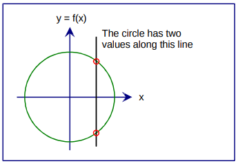
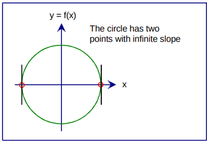

# The Parametric [form of a] Curve

### Explicit form (NOT parametric)

Typically, when a student takes mathematics, a curve is presented as a graph of a function $f(x)$.

As $x$ varies, $y = f(x)$ is computed by the function $f$, and the pair of coordinates $(x, y)$ sweeps out the curve. This is called the *explicit* form of the curve.

In the explicit form, one variable, the dependent variable, is *explicitly* dependent on another variable, the independent variable.

In the example $y = f(x)$,  $x$ is the independent variable and $y$ is the dependent variable.

### Implicit form (also NOT parametric)

What if the curve is defined thus: $x^2 + y^2 = r^2$ ?

This is called an *implicit* form.  The implicit form lacks the idea of one independent variable determining the value of one dependent variable. 

To compute $y$, we need to convert it to an explicit form thus: $ y = \pm \sqrt{r^2 - x^2} $

You may recognize the $\pm$ shorthand for "plus/minus".

What may be less obvious from this mathematical syntax is that there are two explicit equations here.  Written out a bit more expressively, the functions we're working with are as follows:

$$y_{top} = \sqrt{r^2 - x^2}$$

$$y_{bottom} = -\sqrt{r^2 - x^2}$$

So for every input value of x, we have to evaluate two functions.


Are you beginning to see a problem with the explicit (and implicit) form? 

* Single-Valued Problem
  All explicit forms are single-valued.  In other words, for any value of $x$, there is exactly one value of $y$. Explicit form is a good way to represent a function, but you sometimes need more than one function to fully describe a curve as we've seen is the case for a circle.

  

* Infinite Slope Problem

  There's a more subtle problem also. The derivative f'(x) may not be defined everywhere in explicit form. 

  $$y'_{top} = -\frac{x}{\sqrt{r^2 - x^2}}$$

  $$y'_{bottom} = -\frac{x}{\sqrt{r^2 - x^2}}$$

  Hence there are two points on the circle where the derivative of $y=\pm\sqrt{r^2-x^2}$ is undefined. Using limits, we can show that the slope of the circle graph is infinite at those two points (where $x = \pm r$):

  

* Transformation Problems

  Some explicit forms such as that of a line $y = ax + b$, when rotated or sheared, may exhibit the single-value problem and/or the infinite-value problem.  A vertical line is an example which exhibits both problems.


### Parametric Form

The parametric form of a curve is not subject to these limitations. Moreover, it provides a method, known as *parameterization*, that defines motion on the curve. Motion on the curve refers to the way that the point $(x, y)$ traces out the curve .

Parametrization uses an independent parameter (aka variable) to compute points on the curve.  It gives the "motion" of a point on the curve.  For a circle, one popular parameterization is as follows:

$$x = r \cos \theta, 0 \le \theta \le 2\pi$$

$y = r \sin \theta, 0 \le \theta \le 2\pi$

where $r$ is the (constant) radius.

Yes, in this case there are two explicit forms, one for $x$ and one for $y$.  Both $x$ and $y$ are dependent variables of the parameter (aka independent variable) $\theta$.  By convention, we say parameter instead of "independent variable", but the terms are synonymous.


Here is a parameterization of a line:

###### $$x = x_0 + v_xt\ \ \ \ \ \ \ \ -\infty \le t \le \infty$$

###### $$y = y_0 + v_yt\ \ \ \ \ \ \ \ -\infty \le t \le \infty$$

where $(x_0, y_0)$ is the coordinates of some point on the line, $\begin{bmatrix}v_x\\v_y\end{bmatrix}$ is a vector which gives the direction of the line, and $t$ is the parameter.


#### 

#### Exercise 2.4.1

In this exercise, you will draw a circle using an explicit form. 

1. Copy the template/twod project. Run it.
2. Observe that there is a coordinate system centered at the origin.
3. Observe that there is a label for the x axis and for the y axis, and both are defined in `class XYAxes`.
4. Using only the fact that a circle is defined thus $x^2 + y^2 = r^2$, draw a circle like the one in the diagrams above by designing a circle class.  Make the circle class extend `THREE.LineLoop` so that instances of it may be added directly to the scene (similar to the coordinate system).
5. Create a single instance and add it to the scene.


#### Exercise 2.4.2

1. Copy your exercise 2.4.1 to a new project.

2. Add a vertical line to the diagram similar to the one in the top diagram above.

3. Add two small circles similar to the ones in the top diagram above.  You may do this by creating two more instances of your original circle, and transforming them thus:

   ```javascript
   let smallCircle1 = new Circle(0.2);
   smallCircle1.position = new Vector2(3, 5);
   ```

