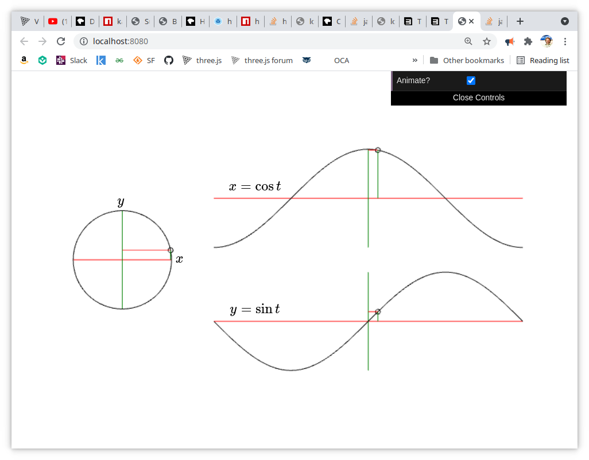

### Defining the Parametric Curve

A parametric curve that lies in a plane is defined by two functions, $x(t)$ and $y(t)$, which use the independent parameter $t$. $x(t)$ and $y(t)$ are coordinate functions, since their values represent the coordinates of points on the curve. As $t$ varies, the coordinates $(x(t), y(t))$ sweep out the curve. As an example consider the two functions:

​	$$x(t) = sin(t), y(t) = cos(t) \tag{2.5}$$

As $t$ varies from ${-\pi}$ to ${\pi}$ , a circle is swept out by $(x(t), y(t))$.

​									***Image 2.5***

**Exercise 2.5**

Write an application in threejs using `template/` as a starting point that has all the same elements and functions of the one shown in Image 2.5 .

